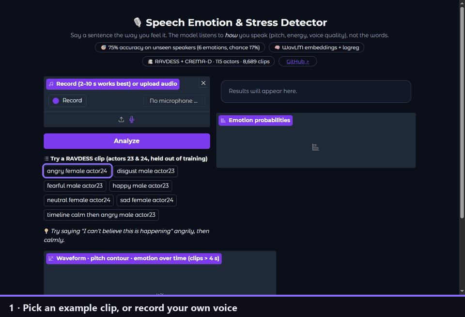
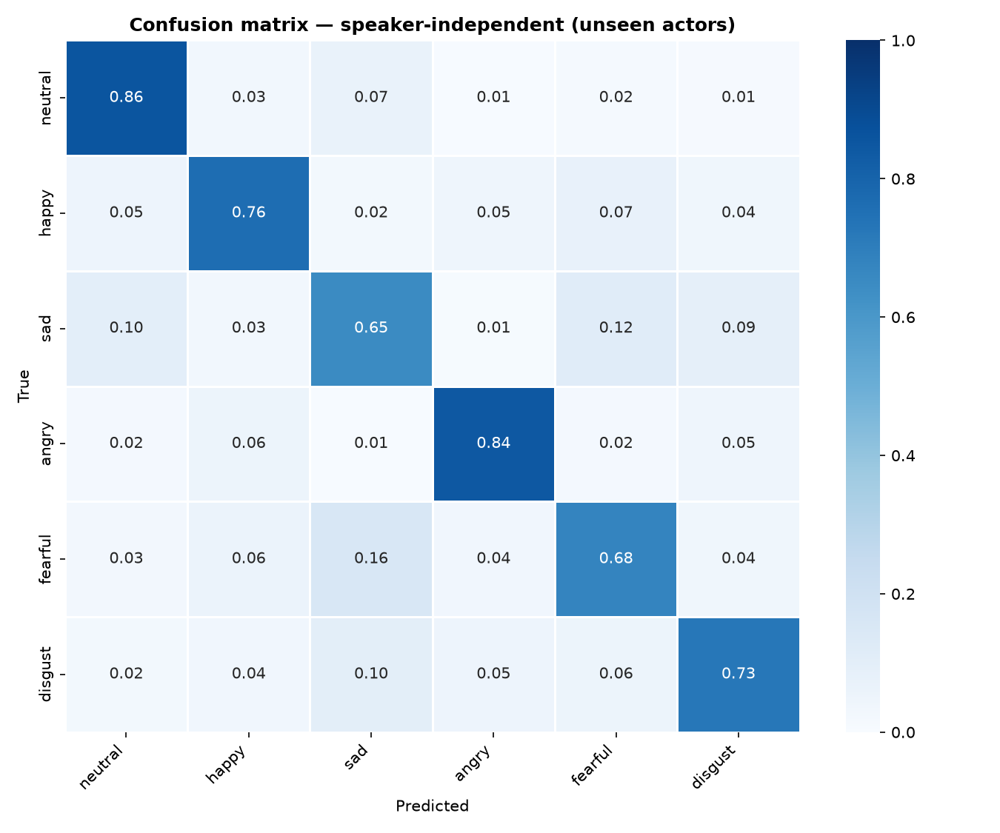
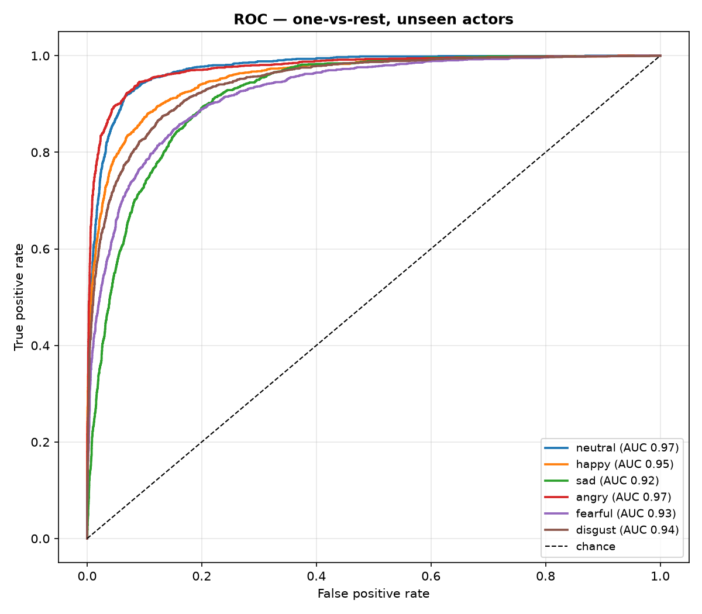
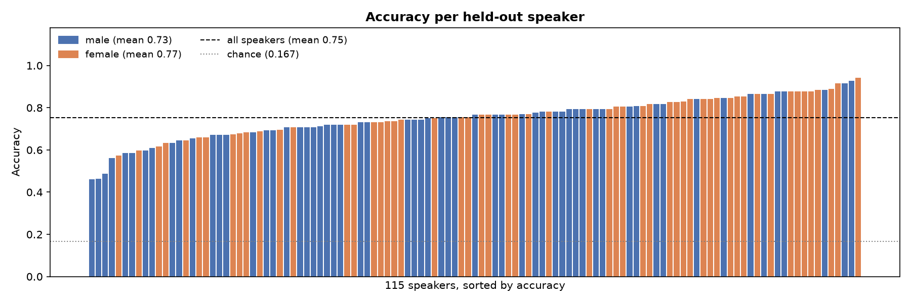
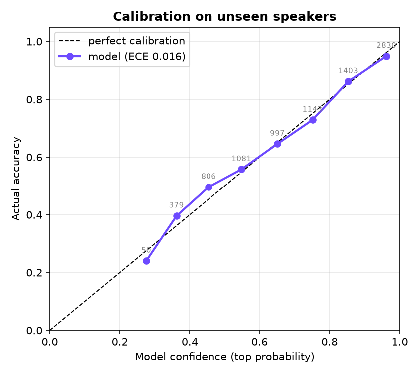
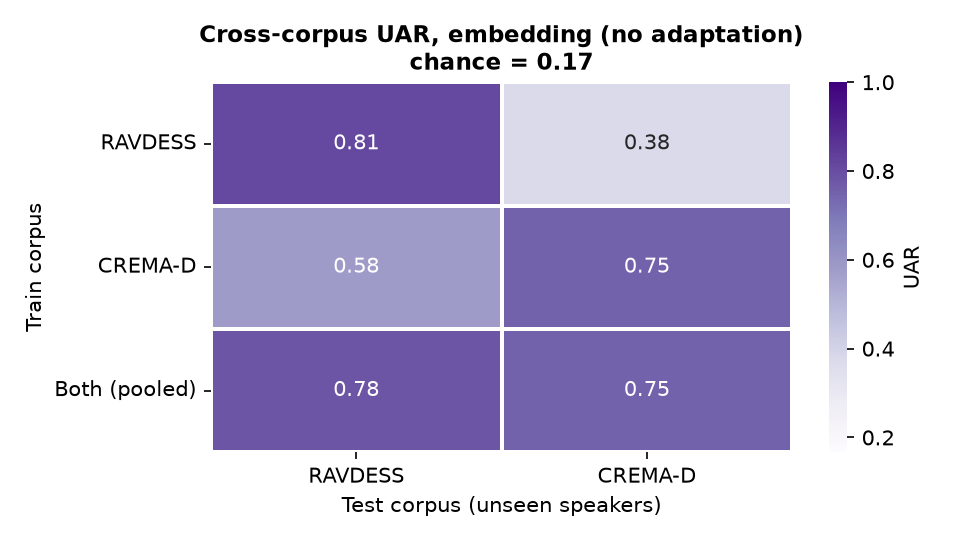

# 🎙️ Speech Emotion & Stress Detection

> Detect emotion and vocal stress from **how** someone speaks: pitch, energy and voice quality, not the words.
> **75% accuracy on 115 speakers the model has never heard, across two independent datasets**
> (RAVDESS + CREMA-D, 6 emotions, chance = 17%). Includes a cross-corpus study showing why training on one dataset isn't enough.

[](https://huggingface.co/spaces/tejaswaghere/stress-detection)
[](https://tejaswaghere.github.io/stress-detection-using-voice-analysis/demo/)
[](https://github.com/tejaswaghere/stress-detection-using-voice-analysis/actions/workflows/ci.yml)
[](https://python.org)
[](LICENSE)

<p align="center">
  
</p>

---

## 🚀 Live demos

| Demo | What it does |
|---|---|
| **[Hugging Face Space ↗](https://huggingface.co/spaces/tejaswaghere/stress-detection)** | Full app: record or upload, then see the emotion, stress index, pitch contour and an **emotion timeline** for longer clips |
| **[Browser demo ↗](https://tejaswaghere.github.io/stress-detection-using-voice-analysis/demo/)** | Lightweight page that records in your browser and calls the same model through the Space API |

Both demos run the trained model. The free Space sleeps when idle, so the first request can take about a minute.

---

## ⚙️ How it works

```
audio (mic / file)
  │
  ├─ preprocess ─ 16 kHz mono → trim silence → peak-normalise              src/features.py
  │
  ├─ embed ────── frozen WavLM-base-plus, layers 4–7, mean-pooled → 768-d  src/embeddings.py
  │
  ├─ speech gate ─ same embedding → "is this speech?" → reject music/noise  src/gate.py
  │
  ├─ classify ─── StandardScaler → logistic regression → 6 emotion probs   src/model.py
  │               trained on RAVDESS + CREMA-D (115 actors, 8,689 clips)    src/train.py
  │
  └─ stress ───── arousal/valence-weighted sum of the probs → 0–100        src/stress.py
```

**Why WavLM?** Hand-crafted MFCC/pitch statistics describe *this* voice in *this* room. They fall apart on new
speakers, and completely on new recording setups (see the cross-corpus results below). WavLM was self-supervised
on 94k hours of speech, and its middle layers encode prosody in a way that transfers. A plain linear classifier on
top is enough. The backbone stays frozen, so training is fast on a laptop CPU and the shipped model is a 37 KB file.

**Why two datasets?** A model trained only on RAVDESS scores 81% on new RAVDESS actors but **38%** on CREMA-D.
Pooling both keeps within-corpus accuracy and fixes the transfer. Your microphone is yet another recording setup,
so training diversity matters more than squeezing out one benchmark.

Training, evaluation, the CLI and both apps all import the same `src/` modules, so the features seen at
inference time are exactly the features the model was trained on.

**Emotions.** The two datasets share 6 emotions: neutral, happy, sad, angry, fearful and disgust. RAVDESS's *calm*
clips are merged into *neutral*. Keeping calm as its own class taught the model "RAVDESS recording conditions = calm":
it predicted calm for 0.0% of CREMA-D clips. Dropping calm made relaxed voices read as *sad*, with 61% of unseen calm
clips flagged as moderately stressed. Merging brings that to 18% at no accuracy cost. RAVDESS's *surprised* has no
counterpart and is dropped.

**Stress index.** Neither dataset has stress labels, so stress is derived from the emotion probabilities using the
circumplex model of affect: stress ≈ high arousal + negative valence.

| angry | fearful | disgust | sad | happy | neutral |
|---|---|---|---|---|---|
| 1.00 | 1.00 | 0.70 | 0.45 | 0.10 | 0 |

Below 30 is *low*, 30–55 is *moderate*, and above 55 is *high*. This is a transparent heuristic, not a validated clinical measure.

---

## 📊 Results

All numbers are **speaker-independent**: 6-fold cross-validation grouped by speaker, so every test clip comes from
speakers absent from training. **UAR** (unweighted average recall, i.e. mean per-class recall) is the standard
speech-emotion metric. It isn't inflated by class imbalance.

### Shipped model: RAVDESS + CREMA-D, 6 emotions

| | Accuracy | UAR | Macro-F1 |
|---|---|---|---|
| All 115 unseen speakers | **75.2% ± 1.8** | **75.3%** | 0.75 |
| RAVDESS speakers | 77.2% | 76.9% | |
| CREMA-D speakers | 74.9% | 75.2% | |

Reproduce with `python src/train.py`.

<table>
<tr><td></td>
<td></td></tr>
</table>



**What the plots show**
- **Sad and fearful are the hardest classes** (F1 0.65 and 0.69), and they're mostly confused with each other
  (12% and 16%). Angry (0.85) and neutral (0.82) are the most distinct.
- **Speakers vary a lot** (46–94% accuracy; 9 of 115 are below 60%), so read any single demo result with that spread in mind.
- **Male voices score lower** (UAR 73.5% vs 77.3% for female). Adding CREMA-D shrank this gap from 10 points
  (RAVDESS-only) to 4 points.

### Speech gate: no emotions for music, noise or silence

The classifier always picks an emotion, even for non-speech (an early version called a pure tone "sad, 90%").
A small logistic-regression gate on the **same WavLM embedding** decides first whether a clip contains speech,
so it adds no extra model and no measurable latency. It was trained on speech, on speech mixed with background
noise and music (0–10 dB SNR), and on non-speech sounds (`python scripts/train_speech_gate.py`).

| Evaluated on unseen speakers / sound types / noise files | Speech gate | Silero VAD (baseline) |
|---|---|---|
| Real speech accepted | **99.97%** | 98.9% |
| Angry & fearful speech accepted | **99.96%** | 97.5% |
| Speech with loud background noise (0 dB SNR) accepted | **97.5%** | |
| Speech in moderate noise (10 dB) / phone-quality speech accepted | **99.8% / 100%** | |
| Music rejected | **100%** | 98.5% |
| Synthetic noise and tones rejected | **100%** | 90.5% |
| Environmental sounds (ESC-50) rejected | 97.7% | 99.4% |

An off-the-shelf voice-activity detector was tried first. At settings that rejected most non-speech, it turned
away **1.7% of angry and fearful speech**: shouting and panicky voices, exactly what a stress detector must not
reject. Training the gate on noisy speech was essential too: without it, 30% of real speech in loud noise was rejected.
Details: [`results/speech_gate/metrics.json`](results/speech_gate/metrics.json).

### Is the confidence trustworthy?



On speakers recorded like the training data, yes. Expected calibration error is **1.6%**: when the model is
≥90% confident it's right **95%** of the time, and below 50% it's right only **46%** of the time. The app says
"low confidence" in that case. Temperature scaling was tested and changed nothing (fitted T = 1.03).

On **unfamiliar recordings it becomes overconfident**. A RAVDESS-trained model is 65% confident on CREMA-D but
38% accurate (ECE 27%), and the reverse direction is 79% confident but 58% accurate (ECE 21%). So the demo's
confidence is most meaningful for clean, close-mic speech. This is a known open problem under domain shift,
and the main reason the model is trained on two corpora.

<br clear="right">

### Cross-corpus generalisation

Within-dataset scores only show the model handles new *speakers* recorded the same way. To test new *recording setups*,
train on one dataset and test on the other (`python src/cross_corpus.py`, 6 shared emotions, UAR, chance = 16.7%):



| Train → test | WavLM | Hand-crafted features |
|---|---|---|
| RAVDESS → RAVDESS | 81.3% | 59.1% |
| CREMA-D → CREMA-D | 75.3% | 55.1% |
| **RAVDESS → CREMA-D** | **37.7%** | **14.3%** (below chance) |
| CREMA-D → RAVDESS | 58.3% | 23.9% |
| RAVDESS → CREMA-D, per-corpus normalisation | 45.3% | 32.7% |
| CREMA-D → RAVDESS, per-corpus normalisation | 70.4% | 37.5% |
| Both → RAVDESS / CREMA-D | 77.9% / 75.3% | 53.4% / 55.7% |

**Findings**
1. **Single-corpus scores overstate real-world accuracy.** The RAVDESS-only model drops from 81% to 38%.
2. **The failure is a recording-channel shift, not missing emotion knowledge.** The RAVDESS-only model calls **51%** of
   CREMA-D clips *fearful* (true share: 17%). Standardising each corpus by its own feature statistics, which uses no
   labels, brings that to 18% and recovers 8–12 points.
3. **Hand-crafted features don't transfer at all.** RAVDESS → CREMA-D is below chance, with nearly every clip put in one class.
   Pretrained representations are essential, not just better.
4. **Pooled training generalises without a trade-off.** It matches the CREMA-D-only model on CREMA-D and loses only 3
   points on RAVDESS.

Details: [`results/cross_corpus/`](results/cross_corpus/).

### Model history (RAVDESS only, 8 emotions)

| Model | Unseen-speaker accuracy | Macro-F1 | Random-split accuracy* |
|---|---|---|---|
| v2: 182 hand-crafted features + SVM (original) | 40.9% | 0.40 | 62.4% |
| v3: 376 hand-crafted features + SVM | 56.7% ± 2.5 | 0.55 | 68.7% |
| v3: WavLM + logistic regression | 79.3% ± 3.7 | 0.79 | 88.8% |

\* *A random clip-level split puts the same actor in both train and test sets, so the model can recognise the voice
instead of the emotion. The README originally reported ~68% from this kind of split. Plots for these runs are in
[`results/embedding_logreg/`](results/embedding_logreg/) and [`results/handcrafted_svm/`](results/handcrafted_svm/), including
permutation feature importance. [`results/layer_probe.json`](results/layer_probe.json) shows accuracy for every WavLM layer:
it peaks at layers 5–6 and drops at the top layers, which specialise in phonetic content.*

---

## 🏁 Quick start

```bash
git clone https://github.com/tejaswaghere/stress-detection-using-voice-analysis.git
cd stress-detection-using-voice-analysis
pip install -r requirements.txt
```

**Run the app** (a trained model ships in `models/`):

```bash
python app/app.py                      # http://localhost:7860
```

**Predict from the command line:**

```bash
python src/predict.py my_recording.wav
```

**Retrain from scratch.** Get the two datasets:

- **RAVDESS**: download the speech subset (`Audio_Speech_Actors_01-24.zip`, 200 MB) from
  [Zenodo](https://zenodo.org/record/1188976) and unzip it into `data/RAVDESS/`.
- **CREMA-D** (600 MB): `python scripts/download_cremad.py`, which fetches the audio from the
  [official repository](https://github.com/CheyneyComputerScience/CREMA-D) into `data/CREMA-D/`.

```bash
python src/train.py                                  # RAVDESS + CREMA-D, WavLM (≈20 min CPU the first time)
python src/train.py --corpora ravdess                # RAVDESS only, 8 emotions
python src/train.py --corpora ravdess --features handcrafted --model svm \
                    --out models/handcrafted_svm.joblib   # no torch needed
python src/cross_corpus.py                           # train-on-one / test-on-the-other study
python scripts/train_speech_gate.py                  # speech vs non-speech gate (downloads ESC-50 clips)
```

Embeddings and features are cached in `data/`, so re-runs take seconds. One CREMA-D file (`1076_MTI_SAD_XX.wav`)
is silent and is skipped automatically.

**Run the tests:**

```bash
pytest
```

**Deploy the Space:**

```bash
python scripts/build_space.py                                          # assembles ./space from src/ + app/
python scripts/build_space.py --push tejaswaghere/stress-detection     # after `hf auth login`
```

---

## 📦 Project structure

```
├── src/
│   ├── features.py     # audio loading/preprocessing + 376 handcrafted features (single source of truth)
│   ├── corpora.py      # RAVDESS / CREMA-D loaders, shared label set, cached feature extraction
│   ├── cross_corpus.py # train-on-one, test-on-the-other experiments
│   ├── embeddings.py   # frozen WavLM embedder (+ sliding windows for the timeline)
│   ├── model.py        # classifiers and versioned model bundles
│   ├── gate.py         # speech gate on the WavLM embedding (rejects music / noise / silence)
│   ├── stress.py       # emotion probabilities → stress index
│   ├── predict.py      # Predictor used by the CLI and the app
│   ├── train.py        # speaker-independent training & evaluation
│   └── evaluate.py     # confusion matrix, ROC, per-actor accuracy, feature importance
├── app/
│   ├── app.py          # Gradio app (also the HF Space)
│   └── examples/       # clips from actors 23 & 24, who are excluded from the final model
├── demo/index.html     # GitHub Pages demo (calls the Space API)
├── scripts/
│   ├── build_space.py      # assembles the HF Space from src/ + app/
│   ├── train_speech_gate.py
│   └── download_cremad.py
├── models/emotion_model.joblib
├── results/            # metrics.json + plots per model
├── tests/
└── notebooks/emotion_detection.ipynb
```

---

## ⚠️ Limitations

- **Acted speech.** Both datasets use actors performing fixed sentences (2 in RAVDESS, 12 in CREMA-D) in American
  English. Spontaneous speech, other languages and accents, background noise and phone microphones are all harder.
  The cross-corpus results show how much a new recording setup can cost, so real-world accuracy will be below 75%.
- **Six emotions only.** Calm is folded into neutral and surprised isn't modelled.
- **Noise changes the emotion, not just the confidence.** The speech gate still accepts speech in loud noise, but heavy
  background noise can shift the predicted emotion (e.g. neutral read as sad). Training the emotion model on
  noisy speech is the next step.
- **Overconfident on unfamiliar audio.** The speech gate rejects non-speech, but for speech recorded unlike its
  training data (music, tones, heavy noise) it can still report high confidence.
- **Stress is inferred, not measured.** Treat it as "tense, negative, high-arousal delivery", not as a diagnosis.
  This is not a medical, HR or lie-detection tool.
- Model selection (WavLM layers, regularisation) was done on the same cross-validation folds, which adds a small
  optimistic bias. The top configurations differ by less than one fold's standard deviation.

## 🗺️ Roadmap

- [x] Speaker-independent evaluation
- [x] Pretrained speech embeddings (WavLM)
- [x] Emotion timeline for long recordings
- [x] Second corpus (CREMA-D) and cross-corpus evaluation
- [x] Speech gate for non-speech audio; calibration measured in- and out-of-domain
- [ ] Naturalistic speech (MSP-Podcast) and a third held-out corpus for testing
- [ ] Fine-tune WavLM end to end with speaker-adversarial training
- [ ] Noise-augmented emotion training (the gate already uses it)
- [ ] Recalibrate confidence under domain shift (e.g. per-user baseline)

## 📚 References

- Livingstone & Russo (2018). [The Ryerson Audio-Visual Database of Emotional Speech and Song (RAVDESS)](https://zenodo.org/record/1188976). *PLOS ONE.* CC BY-NC-SA 4.0.
- Cao et al. (2014). [CREMA-D: Crowd-sourced Emotional Multimodal Actors Dataset](https://github.com/CheyneyComputerScience/CREMA-D). *IEEE Transactions on Affective Computing.* ODbL.
- Chen et al. (2022). [WavLM: Large-Scale Self-Supervised Pre-Training for Full Stack Speech Processing](https://arxiv.org/abs/2110.13900). *IEEE JSTSP.*
- Russell (1980). A circumplex model of affect. *Journal of Personality and Social Psychology.*
- McFee et al. (2015). [librosa](https://librosa.org). *Proceedings of SciPy.*

## 📄 License

Code: [MIT](LICENSE). The bundled example clips and the trained model derive from RAVDESS (CC BY-NC-SA 4.0) and
CREMA-D (ODbL), so they are for non-commercial use with attribution.
