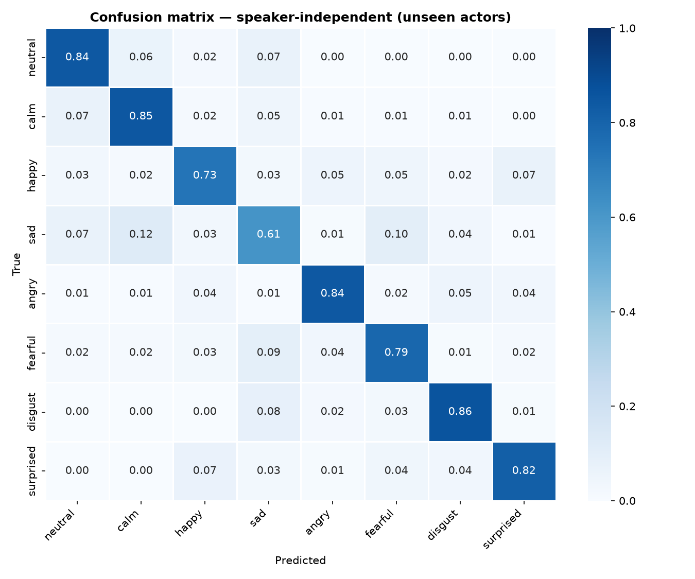
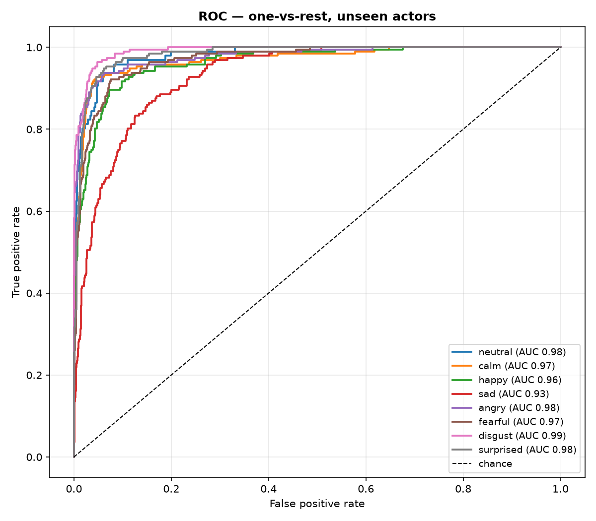
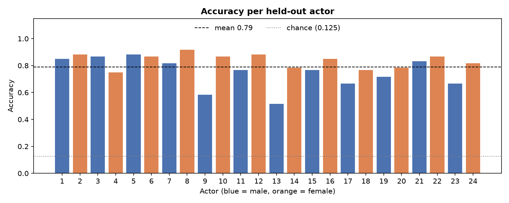

# 🎙️ Speech Emotion & Stress Detection

> Detect emotion and vocal stress from **how** someone speaks: pitch, energy and voice quality, not the words.
> **79% accuracy on speakers the model has never heard** (8 emotions, RAVDESS, chance = 12.5%).

[](https://huggingface.co/spaces/tejaswaghere/stress-detection)
[](https://tejaswaghere.github.io/stress-detection-using-voice-analysis/demo/)
[](https://github.com/tejaswaghere/stress-detection-using-voice-analysis/actions/workflows/ci.yml)
[](https://python.org)
[](LICENSE)

---

## 🚀 Live demos

| Demo | What it does |
|---|---|
| **[Hugging Face Space ↗](https://huggingface.co/spaces/tejaswaghere/stress-detection)** | Full app: record or upload, then see the emotion, stress index, pitch contour and an **emotion timeline** for longer clips |
| **[Browser demo ↗](https://tejaswaghere.github.io/stress-detection-using-voice-analysis/demo/)** | Lightweight page that records in your browser and calls the same model through the Space API |

Both demos run the trained model. The free Space sleeps when idle, so the first request can take about a minute.

---

## ⚙️ How it works

```
audio (mic / file)
  │
  ├─ preprocess ─ 16 kHz mono → trim silence → peak-normalise          src/features.py
  │
  ├─ embed ────── frozen WavLM-base-plus, layers 4–7, mean-pooled → 768-d   src/embeddings.py
  │
  ├─ classify ─── StandardScaler → logistic regression → 8 emotion probs   src/model.py
  │
  └─ stress ───── arousal/valence-weighted sum of the probs → 0–100     src/stress.py
```

**Why WavLM?** Handcrafted MFCC/chroma statistics describe *this* voice. They overfit to the actors in the
training set and fall apart on new speakers. WavLM was self-supervised on 94k hours of speech, and its middle
layers encode prosody in a way that transfers across speakers. A plain linear classifier on top is enough.
The backbone stays frozen, so training takes about 3 minutes on a laptop CPU and the shipped model is a 42 KB file.

Training, evaluation, the CLI and both apps all import the same `src/` modules, so the features seen at
inference time are exactly the features the model was trained on.

**Stress index.** RAVDESS has no stress labels, so stress is derived from the emotion probabilities using the
circumplex model of affect: stress ≈ high arousal + negative valence.

| angry | fearful | disgust | sad | surprised | happy | neutral | calm |
|---|---|---|---|---|---|---|---|
| 1.00 | 1.00 | 0.70 | 0.45 | 0.35 | 0.10 | 0 | 0 |

Below 30 is *low*, 30–55 is *moderate*, and above 55 is *high*. This is a transparent heuristic, not a validated clinical measure.

---

## 📊 Results

All numbers come from **speaker-independent** evaluation: 6-fold cross-validation grouped by actor, so every
test clip comes from 4 actors that were absent from training. Reproduce them with `python src/train.py`.

| Model | Unseen-speaker accuracy | Macro-F1 | Random-split accuracy* |
|---|---|---|---|
| v2: 182 handcrafted features + SVM (previous version) | 40.9% | 0.40 | 62.4% |
| v3: 376 handcrafted features + SVM (`--features handcrafted`) | 56.2% ± 4.8 | 0.55 | 68.7% |
| **v3: WavLM embeddings + logistic regression (default)** | **79.0% ± 4.7** | **0.79** | 88.8% |

\* *A random clip-level split puts the same actor in both train and test sets, so the model can recognise the voice
instead of the emotion. It is shown only to explain the gap. The README previously reported ~68% from this kind of split.
Under speaker-independent evaluation, the original pipeline scores 41%.*

<table>
<tr><td></td>
<td></td></tr>
</table>



**What the plots show**
- **Sad is the hardest class** (F1 0.64). It is confused with calm (12%) and fearful (10%): all three are quiet,
  low-energy deliveries. Angry, disgust and surprised are the most distinct (F1 ≈ 0.85).
- **Accuracy varies a lot between speakers** (52–92%). Two male actors (9, 13) fall below 60%, and male voices
  average 74% against 84% for female voices. Any single demo result should be read with that spread in mind.
- Layer choice: [results/layer_probe.json](results/layer_probe.json) shows accuracy for every WavLM layer. It peaks at
  layers 5–6 (78–79%) and drops at the top layers (69%), which are more specialised for phonetic content.

Handcrafted-model plots, including permutation feature importance, are in [`results/handcrafted_svm/`](results/handcrafted_svm/).

---

## 🏁 Quick start

```bash
git clone https://github.com/tejaswaghere/stress-detection-using-voice-analysis.git
cd stress-detection-using-voice-analysis
pip install -r requirements.txt
```

**Run the app** (a trained model ships in `models/`):

```bash
python app/app.py                      # http://localhost:7860
```

**Predict from the command line:**

```bash
python src/predict.py my_recording.wav
```

**Retrain from scratch.** Download the speech subset of RAVDESS (`Audio_Speech_Actors_01-24.zip`, 200 MB) from
[Zenodo](https://zenodo.org/record/1188976) and unzip it into `data/RAVDESS/`, then run:

```bash
python src/train.py --dataset data/RAVDESS                                   # WavLM (≈3 min CPU)
python src/train.py --dataset data/RAVDESS --features handcrafted --model svm \
                    --out models/handcrafted_svm.joblib                       # no torch needed
```

Embeddings and features are cached in `data/`, so re-runs take seconds.

**Run the tests:**

```bash
pytest
```

**Deploy the Space:**

```bash
python scripts/build_space.py                                          # assembles ./space from src/ + app/
python scripts/build_space.py --push tejaswaghere/stress-detection     # after `hf auth login`
```

---

## 📦 Project structure

```
├── src/
│   ├── features.py     # audio loading/preprocessing + 376 handcrafted features (single source of truth)
│   ├── embeddings.py   # frozen WavLM embedder (+ sliding windows for the timeline)
│   ├── model.py        # classifiers and versioned model bundles
│   ├── stress.py       # emotion probabilities → stress index
│   ├── predict.py      # Predictor used by the CLI and the app
│   ├── train.py        # speaker-independent training & evaluation
│   └── evaluate.py     # confusion matrix, ROC, per-actor accuracy, feature importance
├── app/
│   ├── app.py          # Gradio app (also the HF Space)
│   └── examples/       # clips from actors 23 & 24, who are excluded from the final model
├── demo/index.html     # GitHub Pages demo (calls the Space API)
├── scripts/build_space.py
├── models/emotion_model.joblib
├── results/            # metrics.json + plots per model
├── tests/
└── notebooks/emotion_detection.ipynb
```

---

## ⚠️ Limitations

- **Acted speech.** RAVDESS uses 24 professional actors speaking two fixed sentences in North-American English.
  Spontaneous speech, other languages and accents, background noise and phone microphones are all harder,
  and real-world accuracy will be lower than 79%.
- **Overconfident on unfamiliar audio.** The classifier always picks one of 8 emotions. For audio unlike its
  training data (music, tones, heavy noise) it can still report high confidence.
- **Stress is inferred, not measured.** Treat it as "tense, negative, high-arousal delivery", not as a diagnosis.
  This is not a medical, HR or lie-detection tool.
- Model selection (WavLM layers, regularisation) was done on the same cross-validation folds, which adds a small
  optimistic bias. The top configurations differ by less than one fold's standard deviation.

## 🗺️ Roadmap

- [x] Speaker-independent evaluation
- [x] Pretrained speech embeddings (WavLM)
- [x] Emotion timeline for long recordings
- [ ] Add CREMA-D and MSP-Podcast for more speakers and naturalistic speech
- [ ] Fine-tune WavLM end to end with speaker-adversarial training
- [ ] Out-of-distribution detection ("this doesn't sound like speech")
- [ ] Calibrated confidence (temperature scaling)

## 📚 References

- Livingstone & Russo (2018). [The Ryerson Audio-Visual Database of Emotional Speech and Song (RAVDESS)](https://zenodo.org/record/1188976). *PLOS ONE.* CC BY-NC-SA 4.0.
- Chen et al. (2022). [WavLM: Large-Scale Self-Supervised Pre-Training for Full Stack Speech Processing](https://arxiv.org/abs/2110.13900). *IEEE JSTSP.*
- Russell (1980). A circumplex model of affect. *Journal of Personality and Social Psychology.*
- McFee et al. (2015). [librosa](https://librosa.org). *Proceedings of SciPy.*

## 📄 License

Code: [MIT](LICENSE). The bundled example clips and the trained model derive from RAVDESS (CC BY-NC-SA 4.0), so they are for non-commercial use with attribution.
